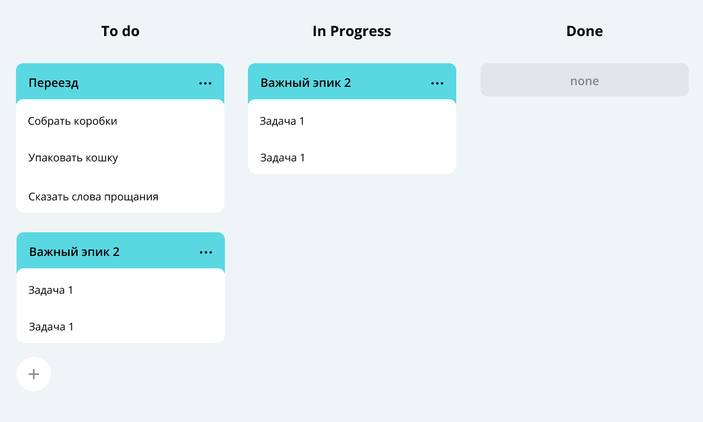

# java-kanban
## Техническое задание проекта №3

### Как человек обычно делает покупки? Если ему нужен не один продукт, а несколько, то очень вероятно, что сначала он составит список, чтобы ничего не забыть. Сделать это можно где угодно: на листе бумаги, в приложении для заметок или, например, в сообщении самому себе в мессенджере.
### А теперь представьте, что это список не продуктов, а полноценных дел.
### И не каких-нибудь простых вроде «помыть посуду» или «позвонить бабушке», а сложных — например, «организовать большой семейный праздник» или «купить квартиру». Каждая из таких задач может разбиваться на несколько этапов со своими нюансами и сроками. А если над их выполнением будет работать не один человек, а целая команда, то организация процесса станет ещё сложнее.

### Как системы контроля версий помогают команде работать с общим кодом, так и трекеры задач позволяют эффективно организовать совместную работу над задачами. Вам предстоит написать бэкенд для такого трекера. В итоге должна получиться программа, отвечающая за формирование модели данных для этой страницы:

## Техническое задание №5

### Обобщение класса Manager

### Создание интерфейса

### Покрытие unit-тестами